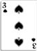



## A Card Trick

### Description

This program is a card trick. You select your card from a column of cards three times, and the program will tell you the card you picked.
 
### More Info
 

             |
---                |---
**Submitted On**   |2001-06-25 14:32:36
**By**             |[Richard Jackson](https://github.com/Planet-Source-Code/PSCIndex/blob/master/ByAuthor/richard-jackson.md)
**Level**          |Beginner
**User Rating**    |4.7 (14 globes from 3 users)
**Compatibility**  |VB 6\.0
**Category**       |[Games](https://github.com/Planet-Source-Code/PSCIndex/blob/master/ByCategory/games__1-38.md)
**World**          |[Visual Basic](https://github.com/Planet-Source-Code/PSCIndex/blob/master/ByWorld/visual-basic.md)
**Archive File**   |[A Card Tri216776252001\.zip](https://github.com/Planet-Source-Code/richard-jackson-a-card-trick__1-24422/archive/master.zip)

